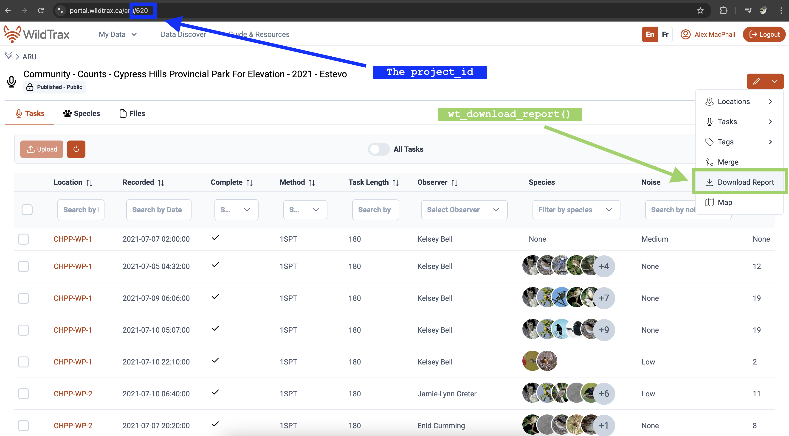

# WildTrax APIs: Authentication, Endpoints, and Usage

## Overview

The purpose of this vignette is to provide a clear introduction to
accessing and interacting with WildTrax through our R package.

An *API* (Application Programming Interface) is a way for one program to
communicate with another over the internet. In this case, the WildTrax
APIs lets R talk to WildTrax servers to retrieve project data,
recordings or tag information without using the website’s user interface
manually.

`wildrtrax` *wraps* the WildTrax API in R functions, so you can easily
authenticate, request data, and work with it in your analysis. You don’t
have to write HTTP requests or handle tokens directly as functions in
the package handle these details and provides user-friendly R functions
to interact with WildTrax programmatically.

## Authenticating to WildTrax

Before accessing WildTrax data, you need to authenticate to obtain a
token. This token lets the server recognize you and grant access to your
data. Currently, authentication is done via **Auth0 login** (Google
login is not supported). To simplify repeated use, store your WildTrax
username and password as environment variables in R. This allows the
package to securely use your credentials without requiring you to type
them each time.


Ensure you use your Auth0 credentials used to login to WildTrax

``` r
# Note that you need to use 'WT_USERNAME' and 'WT_PASSWORD'
Sys.setenv(WT_USERNAME = 'guest', WT_PASSWORD = 'Apple123')
```

Next, you use the
[`wt_auth()`](https://abbiodiversity.github.io/wildrtrax/reference/wt_auth.md)
function to authenticate.

``` r
# Authenticate
wt_auth()
#> Authentication into WildTrax successful.
```

The Auth0 token you obtained will last for 12 hours. After that time,
you will need to re-authenticate.

## Making API calls

Once authenticated, you can now use various functions that call upon the
WildTrax APIs. For instance, you can use
[`wt_get_projects()`](https://abbiodiversity.github.io/wildrtrax/reference/wt_get_projects.md)
to see basic metadata about projects that you can download data for.

``` r
# Download the project summary you have access to
my_projects <- wt_get_projects('ARU')

head(my_projects)
#> # A tibble: 6 × 10
#>   organization_id organization_name project_sensor project_id project           
#>             <int> <chr>             <chr>               <int> <chr>             
#> 1            5351 CWS-ATL           ARU                   934 NF Breeding Bird …
#> 2            5350 CWS-PAC           ARU                  2187 Boreal Monitoring…
#> 3            5351 CWS-ATL           ARU                   935 Newfoundland Bree…
#> 4            5351 CWS-ATL           ARU                   924 Boreal Monitoring…
#> 5            5462 PUNP              ARU                  4091 Pukaskwa National…
#> 6            5350 CWS-PAC           ARU                  2186 Boreal Monitoring…
#> # ℹ 5 more variables: project_status <chr>, project_creation_date <date>,
#> #   project_due_date <date>, task_count <int>, tasks_completed <int>
```

Using the project_id number in the download summary you can then use
[`wt_download_report()`](https://abbiodiversity.github.io/wildrtrax/reference/wt_download_report.md)
to access the species data. You can also find the project_id number in
the url of a WildTrax project,
e.g. <https://portal.wildtrax.ca/home/aru-tasks.html?projectId=620&sensorId=ARU>.
Corresponds to downloading the data from the Project dashboard like
illustrated below.

``` r
# Download the project report
my_report <- wt_download_report(project_id = 620, sensor_id = 'ARU', reports = "main")
```

``` r
head(my_report)
#> # A tibble: 6 × 35
#>   organization project_id location  location_id location_buffer_m longitude
#>   <chr>             <int> <chr>           <int>             <dbl>     <dbl>
#> 1 BU                  620 CHPP-WP-1       94515                NA     -110.
#> 2 BU                  620 CHPP-WP-1       94515                NA     -110.
#> 3 BU                  620 CHPP-WP-1       94515                NA     -110.
#> 4 BU                  620 CHPP-WP-1       94515                NA     -110.
#> 5 BU                  620 CHPP-WP-1       94515                NA     -110.
#> 6 BU                  620 CHPP-WP-1       94515                NA     -110.
#> # ℹ 29 more variables: latitude <dbl>, equipment_make <chr>,
#> #   equipment_model <chr>, recording_id <dbl>, recording_date_time <dttm>,
#> #   task_id <dbl>, task_is_complete <lgl>, task_duration <dbl>,
#> #   task_method <chr>, species_code <chr>, species_common_name <chr>,
#> #   species_scientific_name <chr>, individual_order <int>, tag_id <int>,
#> #   abundance <chr>, vocalization <chr>, detection_time <dbl>,
#> #   tag_duration <dbl>, rms_peak_dbfs <dbl>, tag_is_verified <lgl>, …
```



Project dashboard for downloading reports

An easy way to download multiple projects at once is to use
[`wt_get_projects()`](https://abbiodiversity.github.io/wildrtrax/reference/wt_get_projects.md)
and then filter by a substring in order to get the project ids to
download the data.

``` r
# Download all of the published Ecosystem Health ARU data to a single object
wt_get_projects("ARU") |>
  dplyr::filter(grepl("^Ecosystem Health",project)) %>%
  dplyr::mutate(data = purrr::map(.x = project_id, .f = ~wt_download_report(project_id = .x, sensor_id = "ARU", reports = "main")))
```

WildTrax also pre-formats ARU to point count (PC) data depending on the
type of analysis you wish to perform. See the [Boreal Avian Modelling
project](https://borealbirds.ca/) website and GitHub
[repositories](https://github.com/borealbirds) to find out more on
integration of avian point count and ARU data.

``` r
# As ARU format
my_report
#> # A tibble: 388 × 35
#>    organization project_id location  location_id location_buffer_m longitude
#>    <chr>             <int> <chr>           <int>             <dbl>     <dbl>
#>  1 BU                  620 CHPP-WP-1       94515                NA     -110.
#>  2 BU                  620 CHPP-WP-1       94515                NA     -110.
#>  3 BU                  620 CHPP-WP-1       94515                NA     -110.
#>  4 BU                  620 CHPP-WP-1       94515                NA     -110.
#>  5 BU                  620 CHPP-WP-1       94515                NA     -110.
#>  6 BU                  620 CHPP-WP-1       94515                NA     -110.
#>  7 BU                  620 CHPP-WP-1       94515                NA     -110.
#>  8 BU                  620 CHPP-WP-1       94515                NA     -110.
#>  9 BU                  620 CHPP-WP-1       94515                NA     -110.
#> 10 BU                  620 CHPP-WP-1       94515                NA     -110.
#> # ℹ 378 more rows
#> # ℹ 29 more variables: latitude <dbl>, equipment_make <chr>,
#> #   equipment_model <chr>, recording_id <dbl>, recording_date_time <dttm>,
#> #   task_id <dbl>, task_is_complete <lgl>, task_duration <dbl>,
#> #   task_method <chr>, species_code <chr>, species_common_name <chr>,
#> #   species_scientific_name <chr>, individual_order <int>, tag_id <int>,
#> #   abundance <chr>, vocalization <chr>, detection_time <dbl>, …
```

``` r
# As point count format
head(aru_as_pc)
#> # A tibble: 6 × 23
#>   organization project         project_id location location_id location_buffer_m
#>   <chr>        <chr>                <int> <chr>          <int>             <dbl>
#> 1 BU           Community - Co…        620 CHPP-WP…       94517                NA
#> 2 BU           Community - Co…        620 CHPP-WP…       94518                NA
#> 3 BU           Community - Co…        620 CHPP-WP…       89972                NA
#> 4 BU           Community - Co…        620 CHPP-WP…       89972                NA
#> 5 BU           Community - Co…        620 CHPP-WP…       89972                NA
#> 6 BU           Community - Co…        620 CHPP-WP…       89972                NA
#> # ℹ 17 more variables: latitude <dbl>, longitude <dbl>, survey_id <chr>,
#> #   survey_date <dttm>, survey_url <chr>, observer <chr>,
#> #   survey_distance_method <chr>, survey_duration_method <chr>,
#> #   detection_distance <chr>, detection_time <dbl>, species_code <chr>,
#> #   species_common_name <chr>, species_scientific_name <chr>,
#> #   individual_count <chr>, detection_heard <lgl>, detection_seen <lgl>,
#> #   detection_comments <chr>
```

## Species

Downloading the WildTrax species table with
[`wt_get_species()`](https://abbiodiversity.github.io/wildrtrax/reference/wt_get_species.md)
also grants you access to other valuable columns or provides a complete
list of the species currently supported by WildTrax.

``` r
# Download the WildTrax species table
wt_get_species() |> arrange(species_code)
```

You can also determine which species are allowed in and out of projects
via the
[`wt_get_project_species()`](https://abbiodiversity.github.io/wildrtrax/reference/wt_get_project_species.md)
function. The `included` column will expose which species have been
currently tagged in the Project.

``` r
my_project_species <- wt_get_project_species(620)

my_project_species |>
  filter(included == TRUE)
```


Project species table with included species in list on the right

## Data Discover

Explore species and data within WildTrax’s [Data
Discover](https://discover.wildtrax.ca/) by employing the
[`wt_dd_summary()`](https://abbiodiversity.github.io/wildrtrax/reference/wt_dd_summary.md)
function. Access a portion of data, even without user privileges.
Utilize
[`wt_auth()`](https://abbiodiversity.github.io/wildrtrax/reference/wt_auth.md)
to uncover data pertinent to your account or those publicly available on
WildTrax.

``` r
discover <- wt_dd_summary(sensor = "ARU", species = "White-throated Sparrow", boundary = NULL)
```

``` r
head(discover)
#> $`lat-long-summary`
#> # A tibble: 11 × 5
#>    projectId project_name       count species_common_name species_scientific_n…¹
#>        <int> <chr>              <dbl> <chr>               <chr>                 
#>  1        31 "BU-Community - C…  1232 White-throated Spa… Zonotrichia albicollis
#>  2      1855 "CWS-ONT-Ontario …  1126 White-throated Spa… Zonotrichia albicollis
#>  3        41 "BU-Community - C…   829 White-throated Spa… Zonotrichia albicollis
#>  4      1070 "CWS-ONT-Ontario …   805 White-throated Spa… Zonotrichia albicollis
#>  5      3139 "CWS-ONT-Ontario …   601 White-throated Spa… Zonotrichia albicollis
#>  6       659 "CWS-ONT-Ontario …   528 White-throated Spa… Zonotrichia albicollis
#>  7      2821 "CWS-ONT-Ontario …   469 White-throated Spa… Zonotrichia albicollis
#>  8         1 "ABMI-Ecosystem H…   343 White-throated Spa… Zonotrichia albicollis
#>  9        19 "ABMI-Ecosystem H…   291 White-throated Spa… Zonotrichia albicollis
#> 10       142 "ABMI-Ecosystem H…   280 White-throated Spa… Zonotrichia albicollis
#> 11        NA ""                  8096 White-throated Spa… Zonotrichia albicollis
#> # ℹ abbreviated name: ¹​species_scientific_name
#> 
#> $`map-projects`
#> # A tibble: 11,654 × 4
#>    species_common_name    count longitude latitude
#>    <chr>                  <int>     <dbl>    <dbl>
#>  1 White-throated Sparrow     1     -125.     56.1
#>  2 White-throated Sparrow     1     -125.     56.1
#>  3 White-throated Sparrow     1     -125.     56.1
#>  4 White-throated Sparrow     1     -125.     56.1
#>  5 White-throated Sparrow     1     -125.     56.2
#>  6 White-throated Sparrow     1     -124.     55.6
#>  7 White-throated Sparrow     1     -124.     56.1
#>  8 White-throated Sparrow     1     -124.     56.1
#>  9 White-throated Sparrow     1     -124.     56.1
#> 10 White-throated Sparrow     1     -124.     56.1
#> # ℹ 11,644 more rows
```

Use custom bounding areas:

``` r
# Define a polygon
my_aoi <- list(
  c(-113.96068, 56.23817),
  c(-117.06285, 54.87577),
  c(-112.88035, 54.90431),
  c(-113.96068, 56.23817)
)

discover_with_aoi <- wt_dd_summary(sensor = "ARU", species = "White-throated Sparrow", boundary = my_aoi)

head(discover_with_aoi)
```

``` r
library(sf)
# Alberta bounding box
abbox <- read_sf("...shp") |> # Shapefile of Alberta
  filter(Province == "Alberta") |>
  st_transform(crs = 4326) |> 
  st_bbox()

discover <- wt_dd_summary(sensor = "ARU", species = "White-throated Sparrow", boundary = abbox)

head(discover)
```

## Accessing WildTrax data with `wt_get_sync()` and `wt_get_view()`

[`wt_get_sync()`](https://abbiodiversity.github.io/wildrtrax/reference/wt_get_sync.md)
and
[`wt_get_view()`](https://abbiodiversity.github.io/wildrtrax/reference/wt_get_view.md)
provide programmatic access to WildTrax data through various APIs.
[`wt_get_sync()`](https://abbiodiversity.github.io/wildrtrax/reference/wt_get_sync.md)
interfaces with the synchronization (sync) endpoints, which expose data
associated with Organizations and Projects. These endpoints return data
objects related to locations, visits, deployments, equipment, project
tasks, and tags. The sync APIs are primarily intended for workflows that
require advanced or batch manipulation.
[`wt_get_view()`](https://abbiodiversity.github.io/wildrtrax/reference/wt_get_view.md)
provides access to the user interface views and tables that present
structured representations of WildTrax data. These views are optimized
for reporting and analysis and may aggregate or normalize information.
Used together,
[`wt_get_sync()`](https://abbiodiversity.github.io/wildrtrax/reference/wt_get_sync.md)
and
[`wt_get_view()`](https://abbiodiversity.github.io/wildrtrax/reference/wt_get_view.md)
allow users to retrieve operational data from the WildTrax system and
work with analysis-ready representations of those data within R.


How wt_get_sync() and wt_get_view() relate to Organization locations

``` r
# Extracting location information from all API functions

# All location information from Organization location sync
wt_get_sync(api = "organization_locations", organization = 5205)

# All location information from Locations tab
wt_get_view(api = "organization_locations", organization = 5205)

# All location information from Project location sync
wt_get_sync(api = "project_locations", project = 326)

wt_download_report(project_id = 326, sensor_id = 'ARU', reports = 'location')
```
