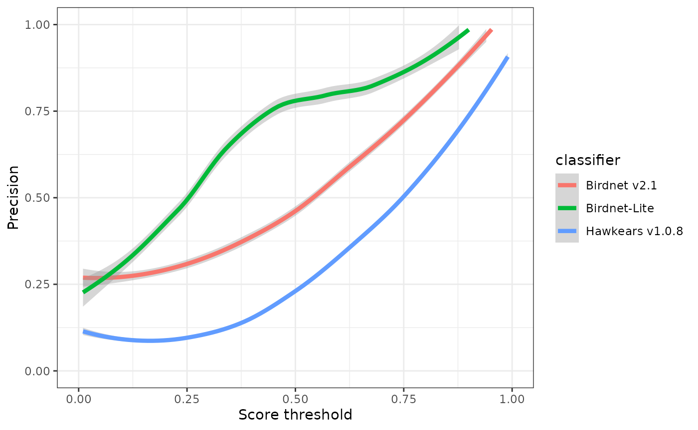
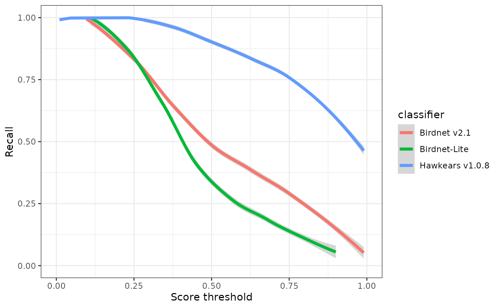
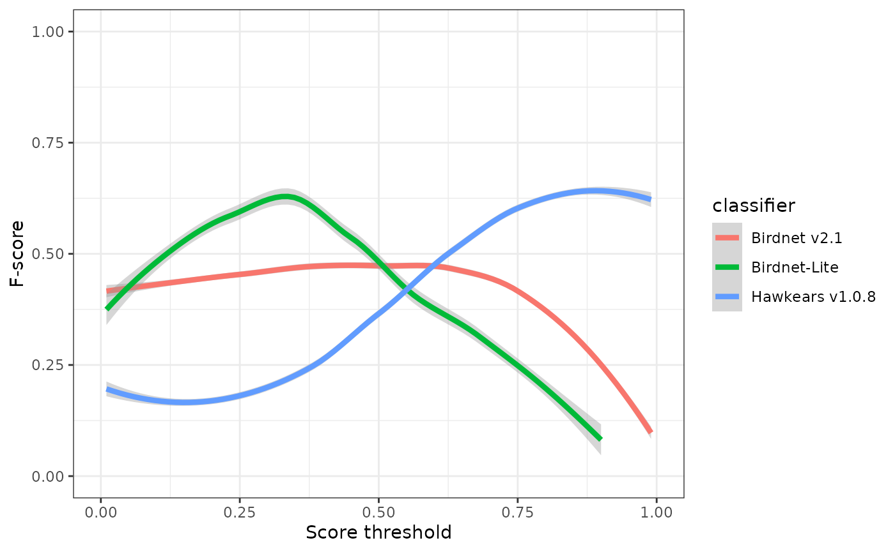
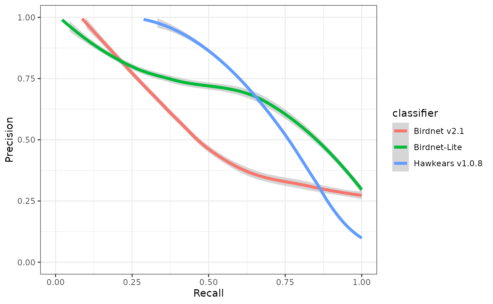
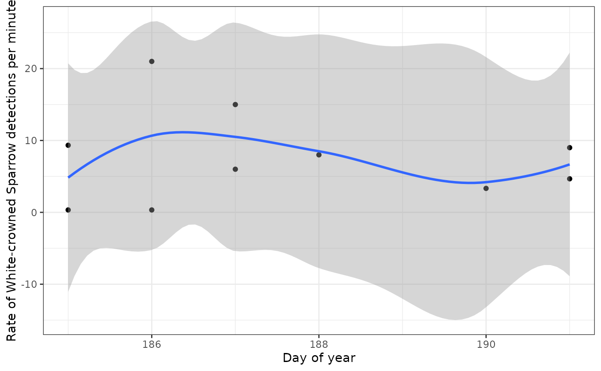

# Acoustic classifiers

## Deep learning in acoustic processing

Recent advances in deep learning have led to the development of neural
network models that can classify the sounds within acoustic recordings,
such as those captured by autonomous recording units (ARUs). These
classifiers can be trained to detect just a single focal species, or to
classify thousands of species. The process of using automated
classifiers to extract species detections from acoustic recordings is
collectively called “computer listening”. This tutorial will show you
how to access and work with classifier results for recordings in
WildTrax.

## Classifiers

The WildTrax 2.0 release (2025) runs inference with two classifiers on
recordings that are uploaded to the system.

[BirdNET](https://birdnet.cornell.edu/) is a deep learning classifier
developed by the Cornell Lab of Ornithology that is trained to classify
more than 6,000 of the world’s most common bird species, including most
North American bird species Kahl et al. (2021).

[HawkEars](https://github.com/jhuus/HawkEars) is also a deep learning
classifier that is specifically trained to classify Canada’s bird
species. HawkEars is implemented in the same fashion as BirdNET so that
users will also be able to download a report. Initial tests of HawkEars
on the same expert dataset as above suggest it performs much better than
BirdNET for Canadian species, with more than double the recall and
higher precision at score thresholds above 0.50 (Huus et al. (2025)).

Both classifiers are run in WildTrax 2.0 without location or date
filtering turned on. The minimum score threshold is 0.20 for BirdNET
version 2.1 and 0.30 for HawkEars version 1.0.8.

## Classifier performance

For each window (typically 3 seconds) of an acoustic recording, the
classifier outputs a score, which is a unitless, numeric expression of
the model’s “confidence” in its prediction, scaled from 0 to 1. Scores
cannot be directly interpreted as probabilities unless they have been
scaled for a particular dataset. Classifier scores can be converted to
species detections by setting a threshold (e.g., 0.8) above which to
consider a species present within a given spectrogram Wood and Kahl
(2024). False positives can still occur at high score thresholds, so
often verification by a human observer is still necessary.

Choosing a score threshold will depend on the goals of the project;
however, threshold choice is a trade-off between false positives (i.e.,
incorrect classifications) and false negatives (i.e., missed detections;
see Priyadarshani, Marsland, and Castro (2018), Knight et al. (2017)).
Choosing a high score threshold will minimize false positives, but will
also result in false negatives. Choosing a low score threshold will
minimize false negatives but will result in many false positives. The
proportion of false positives at a given score threshold is typically
measured by precision:

$precision = \frac{tp}{tp + fp}$

While the proportion of false negatives is measured as recall:

$recall = \frac{tp}{tp + fn}$

Where *tp* is the number of true positives, *fp* is the number of false
positives, and *fn* is the number of false negatives.

The threshold-agnostic performance of a classifier is then typically
evaluated as the area under the curve (AUC) of a precision-recall curve.
The corner of the precision recall curve can be used to select a score
threshold.

F-score is a combination of precision and recall and can also used to
select a score threshold by selecting the peak value.

$Fscore = \frac{2*precision*recall}{precision + recall}$

## Evaluating

Use `wt_download_report(reports = c('main','ai'))` to download the
classifier reports and the main report for further analysis. We can then
combine the `main` report and the `ai` report to evaluate the
classifier’s performance on a given dataset. The
[`wt_evaluate_classifier()`](https://abbiodiversity.github.io/wildrtrax/reference/wt_evaluate_classifier.md)
function takes the output from the
[`wt_download_report()`](https://abbiodiversity.github.io/wildrtrax/reference/wt_download_report.md)
and joins them together and then calculates precision, recall, and
F-score for the requested sequences of thresholds. You can request the
metrics at the minute level for recordings that are processed with the
species per minute method (1SPM). You can also exclude species that are
not allowed in the project from the BirdNET results before evaluation.

``` r
Sys.setenv(WT_USERNAME = 'guest', WT_PASSWORD = 'Apple123')
wt_auth()

#This line will take a minute to run while it downloads the data
data <- wt_download_report(project_id = 620,
                           sensor_id = "ARU",
                           reports = c("main", "ai"))

eval <- wt_evaluate_classifier(data,
                              resolution = "task",
                              remove_species = TRUE,
                              thresholds = c(0.01, 0.99))

head(eval, 10)
```

    ## # A tibble: 10 × 5
    ##    precision recall fscore threshold classifier  
    ##        <dbl>  <dbl>  <dbl>     <dbl> <chr>       
    ##  1     0.273      1  0.429      0.01 Birdnet v2.1
    ##  2     0.273      1  0.429      0.02 Birdnet v2.1
    ##  3     0.273      1  0.429      0.03 Birdnet v2.1
    ##  4     0.273      1  0.429      0.04 Birdnet v2.1
    ##  5     0.273      1  0.429      0.05 Birdnet v2.1
    ##  6     0.273      1  0.429      0.06 Birdnet v2.1
    ##  7     0.273      1  0.429      0.07 Birdnet v2.1
    ##  8     0.273      1  0.429      0.08 Birdnet v2.1
    ##  9     0.273      1  0.429      0.09 Birdnet v2.1
    ## 10     0.273      1  0.429      0.1  Birdnet v2.1

We can plot the results of our evaluation to get an idea of how each
classifier is performing:

``` r
ggplot(eval) +
  geom_smooth(aes(x=threshold, y=precision, colour=classifier), linewidth=1.5) +
  xlab("Score threshold") +
  ylab("Precision") +
  xlim(0,1) +
  ylim(0,1) +
  theme_bw()
```



``` r
ggplot(eval) +
  geom_smooth(aes(x=threshold, y=recall, colour=classifier), linewidth=1.5) +
  xlab("Score threshold") +
  ylab("Recall") +
  xlim(0,1) +
  ylim(0,1) +
  theme_bw()
```



``` r
ggplot(eval) +
  geom_smooth(aes(x=threshold, y=fscore, colour=classifier), linewidth=1.5) +
  xlab("Score threshold") +
  ylab("F-score") +
  xlim(0,1) +
  ylim(0,1) +
  theme_bw()
```



``` r
ggplot(eval) +
  geom_smooth(aes(x=recall, y=precision, colour=classifier), linewidth=1.5) +
  xlab("Recall") +
  ylab("Precision") +
  xlim(0,1) +
  ylim(0,1) +
  theme_bw()
```



## Selecting and filtering a threshold

You can use the precision and recall values in the output of the
[`wt_evaluate_classifier()`](https://abbiodiversity.github.io/wildrtrax/reference/wt_evaluate_classifier.md)
function to select a score threshold manually, or you can use the
[`wt_classifier_threshold()`](https://abbiodiversity.github.io/wildrtrax/reference/wt_classifier_threshold.md)
function to select the highest threshold that maximizes F-score.

``` r
wt_classifier_threshold(eval)
```

    ## # A tibble: 3 × 2
    ##   classifier      threshold
    ##   <chr>               <dbl>
    ## 1 Birdnet v2.1         0.49
    ## 2 Birdnet-Lite         0.7 
    ## 3 Hawkears v1.0.8      0.68

Once a threshold has been selected, the report can be then be filtered
as desired. Whether you’re a human or a computer, all classifiers make
mistakes. But we can select a score threshold that maximizes the
F-score. Let’s look at what our precision is:

``` r
eval[eval$threshold==0.75,]
```

    ## # A tibble: 3 × 5
    ##   precision recall fscore threshold classifier     
    ##       <dbl>  <dbl>  <dbl>     <dbl> <chr>          
    ## 1     0.731  0.322  0.447      0.75 Birdnet v2.1   
    ## 2     0.818  0.191  0.310      0.75 Birdnet-Lite   
    ## 3     0.5    0.749  0.600      0.75 Hawkears v1.0.8

At a score threshold of 0.75, the three classifiers exhibit clearly
divergent performance profiles. BirdNET v2.1 and BirdNET-Lite achieve
relatively high precision (0.73 and 0.82, respectively) but low recall
(0.32 and 0.19), indicating that while most detections are correct, a
substantial proportion of true events are missed. HawkEars v1.0.8 shows
the opposite pattern, with substantially higher recall (0.75) but lower
precision (0.50), resulting in the highest overall F-score (0.60). This
indicates that HawkEars captures the majority of true events but
generates a higher rate of false positives that require subsequent
verification. From a detectability standpoint, these results underscore
that automated classifiers recover only a subset of the detections
identifiable by a human listener, and model outputs, particularly from
high-recall configurations, should be interpreted cautiously when
applied to ecological analyses.

## Check for additional species detected

One of the potential valuable applications of these classifiers is to
check for the presence of additional species in acoustic recordings that
were not detected by human listeners. Ware et al. (2023) found that
supplementing human listener data with verified computer listening
results improved estimates of species richness, particularly for
water-associated birds. We can use the
[`wt_additional_species()`](https://abbiodiversity.github.io/wildrtrax/reference/wt_additional_species.md)
function to check for species reported by each classifier that the human
listeners did not detect in our project. The input for this function
should be the output from the
[`wt_download_report()`](https://abbiodiversity.github.io/wildrtrax/reference/wt_download_report.md)
function when you request the `main` and `ai` reports and you will need
to set a score threshold.

Let’s use a high threshold (0.8) on our example dataset to see if any
new species are detected. We can use the resolution argument to specify
whether we want to look for new species in each task, recording,
location, or in the entire project. Let’s pretend we’re interested in
site-specific species richness and use the task argument.

``` r
new <- wt_additional_species(data, remove_species = TRUE, threshold = 0.8, resolution="task")

new
```

    ## # A tibble: 98 × 14
    ##    location_id recording_id task_id species_common_name  confidence organization
    ##          <int>        <dbl>   <dbl> <chr>                     <dbl> <chr>       
    ##  1       89970       211641  180880 Belted Kingfisher         0.906 BU          
    ##  2       89970       211641  180880 Chestnut-backed Chi…      0.853 BU          
    ##  3       89970       211641  180880 Dusky Flycatcher          0.961 BU          
    ##  4       89970       211641  180880 Red-winged Blackbird      0.957 BU          
    ##  5       89970       211641  180880 Song Sparrow              0.931 BU          
    ##  6       89970       211641  180880 Townsend's Warbler        0.864 BU          
    ##  7       89970       211643  180882 Northern House Wren       0.884 BU          
    ##  8       89970       211649  180888 Mountain Chickadee        0.803 BU          
    ##  9       89970       211649  180888 Sharp-shinned Hawk        0.856 BU          
    ## 10       89972       211642  180881 Northern House Wren       0.977 BU          
    ## # ℹ 88 more rows
    ## # ℹ 8 more variables: version <chr>, location <chr>,
    ## #   recording_date_time <dttm>, recording_length <dbl>, scientific_name <chr>,
    ## #   species_code <chr>, ai_detection_time <dbl>,
    ## #   is_species_allowed_in_project <lgl>

There are potentially 98 new species detections in our dataset. In this
case, you can then format the output of these results to fit with tag
sync and either check the tasks individually, or synchronize the tags
and check them via species verification.

``` r
wt_additional_species(data, remove_species = TRUE, threshold = 0.8, resolution="task", format_to_tags = T)
```

    ## # A tibble: 98 × 17
    ##    location  recording_date_time task_duration task_method observer species_code
    ##    <chr>     <dttm>                      <dbl> <chr>       <chr>    <chr>       
    ##  1 CHPP-WP-5 2021-07-07 06:40:00           180 1SPT        Not Ass… BEKI        
    ##  2 CHPP-WP-5 2021-07-07 06:40:00           180 1SPT        Not Ass… CBCH        
    ##  3 CHPP-WP-5 2021-07-07 06:40:00           180 1SPT        Not Ass… DUFL        
    ##  4 CHPP-WP-5 2021-07-07 06:40:00           180 1SPT        Not Ass… RWBL        
    ##  5 CHPP-WP-5 2021-07-07 06:40:00           180 1SPT        Not Ass… SOSP        
    ##  6 CHPP-WP-5 2021-07-07 06:40:00           180 1SPT        Not Ass… TOWA        
    ##  7 CHPP-WP-5 2021-07-06 05:20:00           180 1SPT        Not Ass… NHWR        
    ##  8 CHPP-WP-5 2021-07-04 22:00:00           180 1SPT        Not Ass… MOCH        
    ##  9 CHPP-WP-5 2021-07-04 22:00:00           180 1SPT        Not Ass… SSHA        
    ## 10 CHPP-WP-6 2021-07-04 05:00:00           180 1SPT        Not Ass… NHWR        
    ## # ℹ 88 more rows
    ## # ℹ 11 more variables: individual_number <int>, vocalization <chr>,
    ## #   abundance <dbl>, tag_start_time <dbl>, tag_duration <chr>,
    ## #   min_tag_freq <chr>, max_tag_freq <chr>, species_individual_comments <chr>,
    ## #   tag_is_hidden_for_verification <lgl>, recording_sample_frequency <dbl>,
    ## #   internal_tag_id <chr>

If no human-generated tags exist in a project, in other words you are
only using classifiers to detect species, additional tags can be easily
synchronized with `wt_additional_tags(format_to_tags = TRUE)` along with
an output folder. If you are adding additional tags to a human processed
data set, the best approach is sync the tags onto new tasks. Generate
tasks with the ‘Not Assigned’ observer and then sync the output of
`wt_additional_tags()`. The common error you may encounter are when
there are either conflicts for the number of individuals assigned
relative to the task method. .

## Individual calls

Another potential use for BirdNET and HawkEars in WildTrax is to use it
to detect individual calls as opposed to just the first call in each
task (1SPT) or minute (1SPM). This might be of interest if you’re using
call rate in a behavioural analysis, or if you’re looking for detections
for tool development like distance estimation or building a focal
species recognizer. Let’s try it for White-crowned Sparrow (WCSP):

``` r
#Evaluate classifier performance

eval_wcsp <- wt_evaluate_classifier(data,
                              resolution = "task",
                              remove_species = TRUE,
                              species = "White-crowned Sparrow",
                              thresholds = c(0.25, 0.99))

#Filter the detections to the best threshold
threshold_wcsp <- wt_classifier_threshold(eval_wcsp)

#Look at performance at that threshold
eval_wcsp[eval_wcsp$threshold==min(threshold_wcsp$threshold),]

#Filter to detections
detections_wcsp <- data[[1]] |>
  filter(species_common_name == "White-crowned Sparrow", 
         confidence > min(threshold_wcsp$threshold))
```

As before, you’ll probably want to upload your detections to WildTrax
for verification, even though the classifiers performance for
White-crowned Sparrow is pretty good. Let’s take a look at our output as
call rate to see if it’s higher at the beginning of the season, as we
would expect:

``` r
#Calculate detections per second and mean confidence in each recording
rate_wcsp <- detections_wcsp |> 
  group_by(location_id, recording_date_time, recording_length, version) |>
  summarise(calls = n(),
            confidence = mean(confidence),
            .groups = "keep") |> 
  ungroup() |> 
  mutate(rate = calls/recording_length*60,
         recording_date_time = as.POSIXct(recording_date_time),
         yday = as.numeric(format(recording_date_time, "%j")),
         hour = as.numeric(format(recording_date_time, "%H")))

#Filter to the sites with most recordings with detections
occupied_wcsp <- rate_wcsp |> 
  group_by(location_id) |> 
  mutate(recordings = n()) |> 
  ungroup() |> 
  filter(recordings >= 4)

#Plot call rate by day of year
ggplot(occupied_wcsp) + 
  geom_point(aes(x=yday, y=rate)) +
  geom_smooth(aes(x=yday, y=rate)) +
  xlab("Day of year") +
  ylab("Rate of White-crowned Sparrow detections per minute") +
  theme_bw()
```



## Other applications

Visit the [BirdNET Github
repository](https://github.com/birdnet-team/BirdNET-Analyzer) and
[HawkEars Github repository](https://github.com/jhuus/HawkEars) to run
or modify these classifiers on your own computer. The decision to pursue
other applications should be made with the effect of a classifier’s low
recall rate in mind:

1.  With presence / absence data, a classifier is unlikely to be
    reliably to confirm absences due to the low recall.

2.  Classifier data can be used for occupancy modelling
    ((**wood_2023?**)), and there are approaches that can accommodate
    false positive error rates to preclude verification of all
    detections (Rhinehart, Turek, and Kitzes (2022)). However, users
    should keep in mind that occupancy modelling is recommended only for
    detection probabilities \>30% and that recall from BirdNET may be
    too low for reliable occupancy estimates for many species (Knight et
    al. (2017)).

See Pérez-Granados (2023) for a full review of some classifier
applications and performance.

Huus, Jan, Kevin G Kelly, Erin M Bayne, and Elly C Knight. 2025.
“HawkEars: A Regional, High-Performance Avian Acoustic Classifier.”
*Ecological Informatics* 87: 103122.

Kahl, Stefan, Connor M Wood, Maximilian Eibl, and Holger Klinck. 2021.
“BirdNET: A Deep Learning Solution for Avian Diversity Monitoring.”
*Ecological Informatics* 61: 101236.

Knight, Emily C., K. C. Hannah, G. Foley, C. Scott, R. Mark Brigham, and
Erin Bayne. 2017. “Recommendations for Acoustic Recognizer Performance
Assessment with Application to Five Common Automated Signal Recognition
Programs.” *Avian Conservation and Ecology* 12 (2): 14.
<https://doi.org/10.5751/ACE-01114-120214>.

Pérez-Granados, Cristian. 2023. “BirdNET: Applications, Performance,
Pitfalls and Future Opportunities.” *Ibis* 165 (3): 1068–75.

Priyadarshani, Nirosha, Stephen Marsland, and Isabel Castro. 2018.
“Automated Birdsong Recognition in Complex Acoustic Environments: A
Review.” *Journal of Avian Biology* 49 (5): jav–01447.

Rhinehart, Tessa A, Daniel Turek, and Justin Kitzes. 2022. “A
Continuous-Score Occupancy Model That Incorporates Uncertain Machine
Learning Output from Autonomous Biodiversity Surveys.” *Methods in
Ecology and Evolution* 13 (8): 1778–89.

Ware, Lena, C Lisa Mahon, Logan McLeod, and Jean-Francois Jette. 2023.
“Artificial Intelligence (BirdNET) Supplements Manual Methods to
Maximize Bird Species Richness from Acoustic Data Sets Generated from
Regional Monitoring.” *Canadian Journal of Zoology* 101 (12): 1031–51.

Wood, Connor M, and Stefan Kahl. 2024. “Guidelines for Appropriate Use
of BirdNET Scores and Other Detector Outputs.” *Journal of Ornithology*
165 (3): 777–82.
